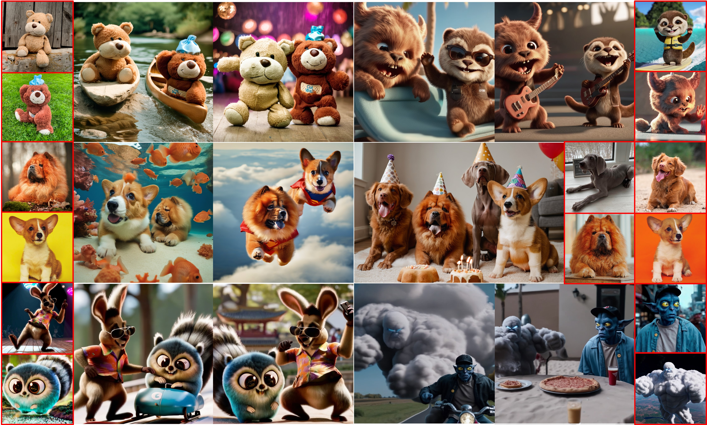
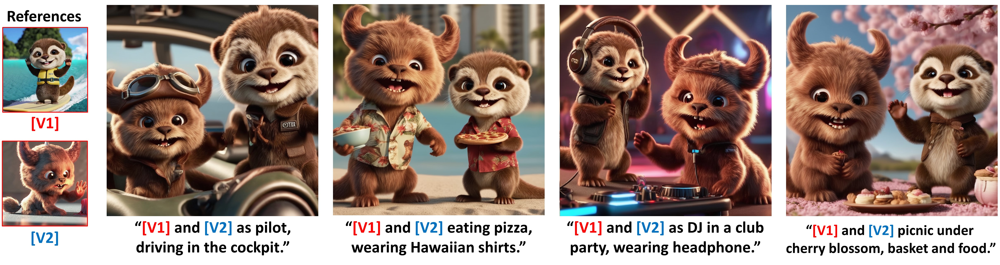
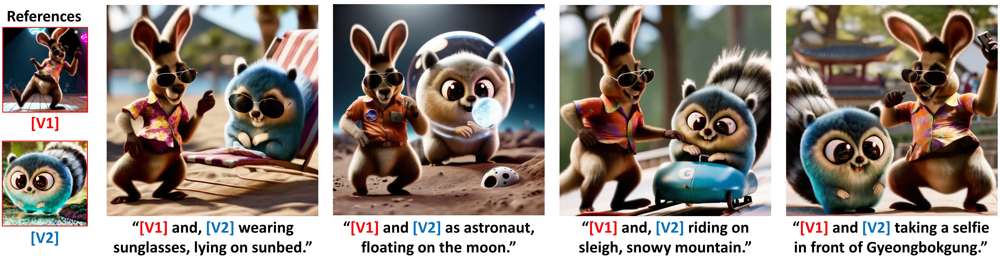
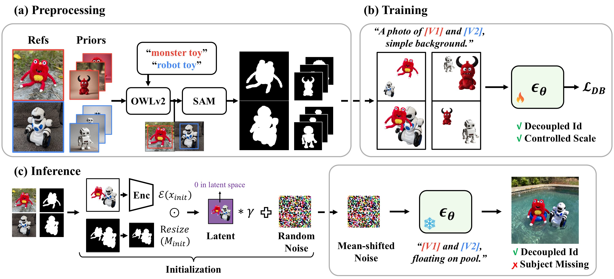
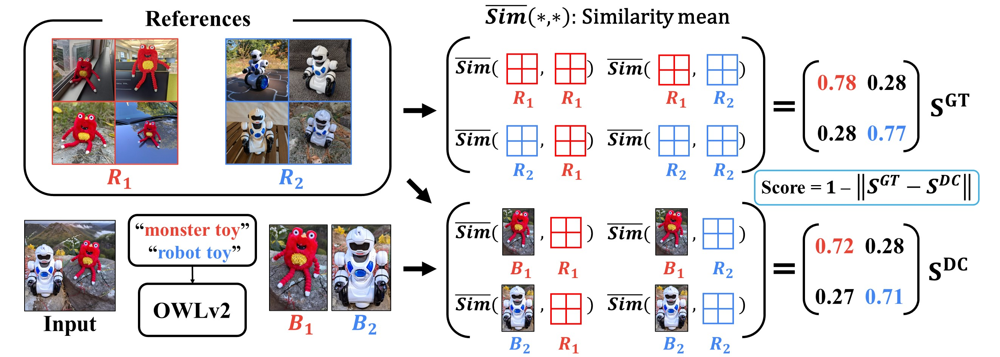
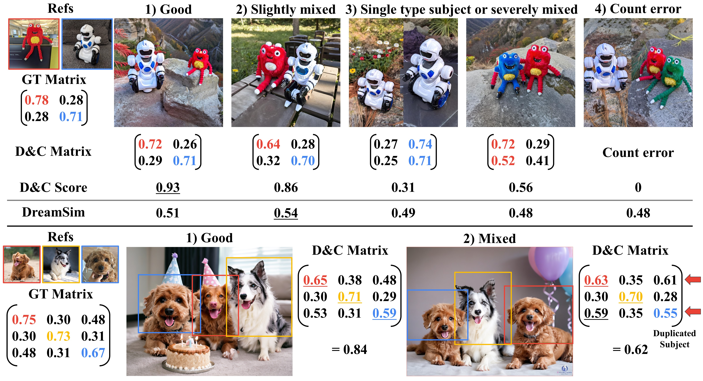

# MuDI
🔥🔥🔥: We updated our Seg-Mix training code FLUX! \
🔥🔥: Try to use our new metric for multi-subject fidelity, **Detect-and-Compare**!

------

This is an official implementation of paper 'Identity Decoupling for Multi-Subject Personalization of Text-to-Image Models'.

**[NeurIPS 2024]**- **[Identity Decoupling for Multi-Subject Personalization of Text-to-Image Models](https://arxiv.org/abs/2404.04243)**
<br/>
[Sangwon Jang<sup>*<sup>](https://agwmon.github.io/), [Jaehyeong Jo<sup>*<sup>](http://harryjo97.github.io/), [Kimin Lee<sup>†<sup>](https://sites.google.com/view/kiminlee), [Sungju Hwang<sup>†<sup>](http://www.sungjuhwang.com/)
<br/>(* indicates equal contribution, † indicates equal advising)

[](https://mudi-t2i.github.io/) [](https://arxiv.org/abs/2404.04243)

## Results





## Method details

**Overview of MuDI.** (a) We automatically obtain segmented subjects using SAM and OWLv2 in the preprocessing stage. (b) We augment the training data by randomly positioning segmented subjects with controllable scales to train the diffusion model εθ. We refer to this data augmentation method as *Seg-Mix*. (c) We initialize the generation process with mean-shifted noise created from segmented subjects, which provides a signal for separating identities without missing.
## Installation
```
pip install diffusers[torch] transformers peft wandb scipy

# for automatic masking
pip install git+https://github.com/facebookresearch/segment-anything.git
```

## Data preparation
Our training is based on DreamBooth and an additional augmentation method. For training, a segmentation mask is necessary, and the same goes for a prior preservation dataset.

### Personalization dataset

Automatic mask generation for the personalization dataset is available, but we recommend manually creating masks with precision using the Segment-Anything model.

In `dataset/category/actionfigure_2_and_dog0/metadata.jsonl`, we provide an example of our experiment setting.
```
{"id": {"a": "olis harry potter toy", "b": "hta corgi"}}
{"id": "a", "file_name": "a00.jpg", "mask_path": "mask_a00.jpg", "text": "A photo of a olis harry potter toy set on a polished wooden desk, with the sleek edge of a laptop and mouse in view."}
{"id": "a", "file_name": "a01.jpg", "mask_path": "mask_a01.jpg", "text": "A photo of a olis harry potter toy displayed on a smooth, dark surface with a vibrant blue cup in the background."}
{"id": "a", "file_name": "a02.jpg", "mask_path": "mask_a02.jpg", "text": "A photo of a olis harry potter toy standing confidently on a black surface with a white wall in the backdrop."}
{"id": "a", "file_name": "a03.jpg", "mask_path": "mask_a03.jpg", "text": "A photo of a olis harry potter toy captured against the contrast of a deep black tabletop and a striking blue cup in the background."}
{"id": "a", "file_name": "a04.jpg", "mask_path": "mask_a04.jpg", "text": "A photo of a olis harry potter toy strategically positioned on a desk with an intricate wood grain pattern and office supplies in soft focus behind."}
{"id": "b", "file_name": "b00.jpg", "mask_path": "mask_b00.jpg", "text": "A photo of a hta corgi with a backdrop of soft-hued cherry blossoms."}
{"id": "b", "file_name": "b01.jpg", "mask_path": "mask_b01.jpg", "text": "A photo of a hta corgi with a serene sky and flowering branches above."}
{"id": "b", "file_name": "b02.jpg", "mask_path": "mask_b02.jpg", "text": "A photo of a hta corgi against a vibrant orange backdrop and delicate flowers."}
{"id": "b", "file_name": "b03.jpg", "mask_path": "mask_b03.jpg", "text": "A photo of a hta corgi before a backdrop of cherry blossoms and a terracotta wall."}
{"id": "b", "file_name": "b04.jpg", "mask_path": "mask_b04.jpg", "text": "A photo of a hta corgi in an urban park setting with blurred foliage."}
```
The 'id' key in the first line only needs to be different from each other, and the value is used in the prompt for the seg-mix sample.
### Prior dataset
We found that using [DCO loss](https://github.com/kyungmnlee/dco) showed almost similar performance to Dreambooth(MSE Loss), **without the need for constructing a prior-preservation dataset**. Therefore, we used DCO loss instead in our code. 

However, all the experiments reported in our paper were conducted with Dreambooth using prior-preservation loss. If you want to re-implement, please check our automatic prior dataset generation pipeline. 
<details>
<summary>Prepare prior dataset</summary>
<div markdown="1">

We provide an automatic mask generation pipeline for the prior dataset. The prior mask does not need to be very accurate.
```
python generate_prior.py --gen_class $CLASS --gen_mask
```
In `dataset/reg/actionfigure_2_and_dog0/class_metadata.jsonl`, we provide an example of our experiment setting.

</div>
</details>


## Seg-Mix
In our experiments, about 18GB of GPU VRAM was used, and it is possible to run on < 15GB VRAM using --gradient_checkpoint.
```
VAL_PROMPT="olis harry potter toy and hta corgi playing together, floating on the pool."
DATASET_NAME="actionfigure_2_and_dog0"
SEG_MIX_PROB=0.3
SEG_MIX_START_STEP=0

accelerate launch train_segmix_lora_sdxl.py --instance_data_dir="dataset/category/"$DATASET_NAME \
    --pretrained_model_name_or_path=$SDXL_PATH \
    --pretrained_vae_model_name_or_path=$VAE_PATH \
    --output_dir=output/$DATASET_NAME"_p"$SEG_MIX_PROB"_s"$SEG_MIX_START_STEP \
    --validation_prompt="$VAL_PROMPT" --report_to=wandb --resolution=1024 --train_batch_size=1 --gradient_accumulation_steps=2 \
    --checkpointing_steps=20000 --max_train_steps=2010 --validation_epochs=3 --save_steps=200 --lr_warmup_steps=0 --seed=42 --rank=32 --learning_rate=1e-4 \
    --segmix_prob=$SEG_MIX_PROB --segmix_start_step=$SEG_MIX_START_STEP --relative_scale=0.0 --soft_alpha 1.0
```
## Seg-Mix with FLUX
Check flux directory.
```
export MODEL_NAME="/data/model/FLUX.1-dev"
export TRAIN_CONFIG_PATH="flux/teddys"
export WANDB_NAME="test"

accelerate launch flux/train_segmix_lora_flux.py \
  --pretrained_model_name_or_path=$MODEL_NAME --mixed_precision="bf16" \
  --instance_data_dir=$TRAIN_CONFIG_PATH --caption_column="text" \
  --resolution=512  --learning_rate=3e-4 \
  --train_batch_size=1 --gradient_accumulation_steps=4 --rank=32 \
  --max_train_steps=2010 --checkpointing_steps=20000 --save_steps=500 --validation_epochs 40 \
  --lr_scheduler="constant" --lr_warmup_steps=0 \
  --seed=42 \
  --output_dir="output_flux/"$WANDB_NAME \
  --validation_prompt="a olis beige teddy bear and hta brown teddy bear dancing in the disco party, 4K, high quality" --report_to="wandb" --wandb_name=$WANDB_NAME --guidance_scale=1 \
  --segmix_prob=0.3 --segmix_start_step=0
```
* FLUX outperforms SDXL in multi-subject personalization, showing strong results even without our initialization! (So, we exclude it in our pipeline with FLUX)
* FLUX is also robust to overfitting without DreamBooth's prior-preservation loss, making it unnecessary.

## Inference
We provide an example of our Seg-Mix trained model. (olis harry potter toy & hta corgi) [Google Drive](https://drive.google.com/file/d/1qNaZjf7pA-odpBwALbAaceZ06rmS0xAi/view?usp=sharing)

(Update; 25.Jan.17) Additionally, we also provide our Seg-Mix trained model with five subjects. [Google Drive](https://drive.google.com/drive/folders/1fCBCJVjP6nINozdUjUwmVcst5-Z8niKx?usp=drive_link)

Please see `inference_demo.ipynb` and `inference_demo_more_than_two.ipynb`

## Benchmark dataset
We provide the combinations of concepts we used in the experiment, along with the training prompts. These data were selected from [DreamBench](https://github.com/google/dreambooth/tree/main/dataset) and [CustomConcept101](https://github.com/adobe-research/custom-diffusion/tree/main/customconcept101), and the captions were generated using ChatGPT. Additional details can be found in the paper.


## Detect & Compare



We introduce a new metric, **Detect-and-Compare**, for evaluating multi-subject fidelity, which demonstrates a higher correlation with human evaluation compared to existing metrics.  For details, refer to our paper and `detect_and_compare/demo.ipynb`. ~~This includes [DreamSim](https://github.com/ssundaram21/dreamsim), which utilizes an older version of the PEFT library, so downgrading the library version is necessary.~~

## TODO
- [X] Update Detect-and-Compare with newer version of DreamSim

## Bibtex
```
@misc{jang2024identity,
      title={Identity Decoupling for Multi-Subject Personalization of Text-to-Image Models}, 
      author={Sangwon Jang and Jaehyeong Jo and Kimin Lee and Sung Ju Hwang},
      year={2024},
      eprint={2404.04243},
      archivePrefix={arXiv},
      primaryClass={cs.CV}
}

@inproceedings{
  jang2024identity,
  title={Identity Decoupling for Multi-Subject Personalization of Text-to-Image Models},
  author={Sangwon Jang and Jaehyeong Jo and Kimin Lee and Sung Ju Hwang},
  booktitle={The Thirty-eighth Annual Conference on Neural Information Processing Systems},
  year={2024},
  url={https://openreview.net/forum?id=tEEpVPDaRf}
}
```
      
